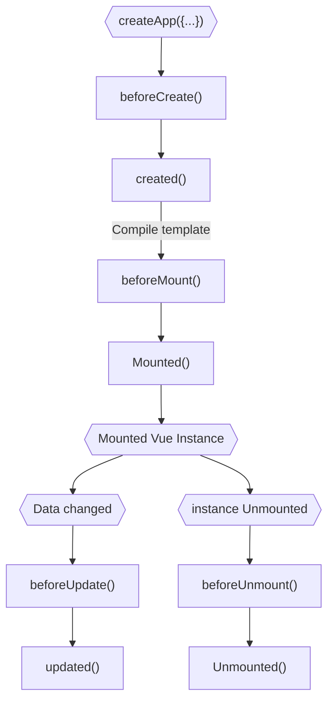

# Vue.js

## Lifcycle



## < template >

les templates peuvent etre ecris comme il suit :

```js
const app = Vue.createApp({
  template: `
  <p>{{ favoriteMeal }}</p>
  `,
  data() {
    return {
      favoriteMeal: 'Pizza'
    }
  }
})

app.mount('#app')
```

## refs

Vue peut recupérer les valeurs dans le DOM, quand on en a besoin, plutot qu'a chaque fois :

- [index.html](index.html)

  ```html
  <input type="text" ref="userText" />
  ```

- [app.js](app.js)

  ```js
  this.message = this.$refs.userText.value
  ```

  - **`$`** signifie que c'est une '_built-in property_'

`ref` fonctionne comme `useRef` dans React.
